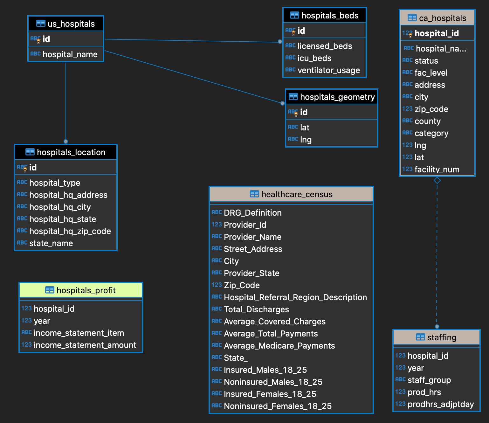

# ETL Project

Data Science and Visualization Boot Camp (Northwestern University)


[](http://commonmark.org)
[](https://github.com/zsvorenova/ETL-project/tree/oleg)


## Database ERD



## Granting Access

```sql
--Create User

CREATE USER group_user WITH LOGIN NOSUPERUSER NOCREATEDB  NOCREATEROLE INHERIT NOREPLICATION   CONNECTION LIMIT -1 PASSWORD 'BootCamp';

-- Grant connect to my data base

GRANT CONNECT ON DATABASE etl_project TO group_user;

-- Grant usage the schema

GRANT USAGE ON SCHEMA public TO group_user ;

-- Grant all table for SELECT, INSERT, UPDATE, DELETE

GRANT SELECT, INSERT, UPDATE, DELETE ON ALL TABLES IN SCHEMA  public TO group_user;

```
